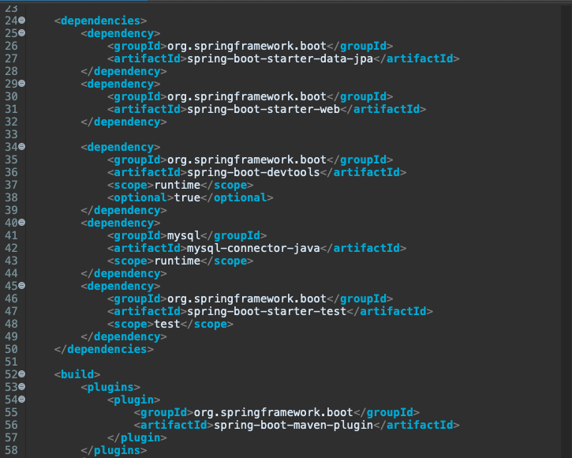
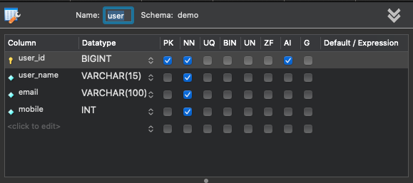
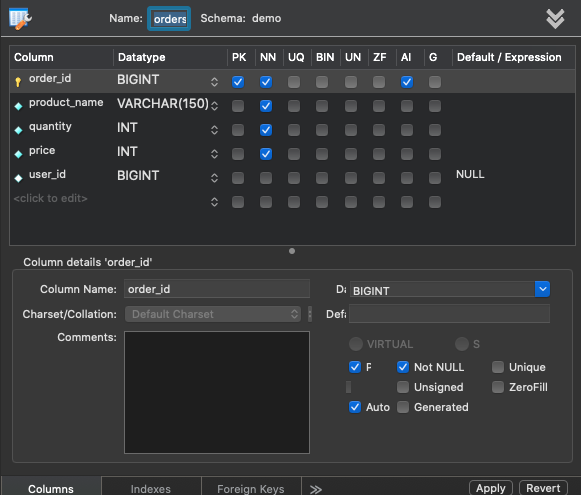
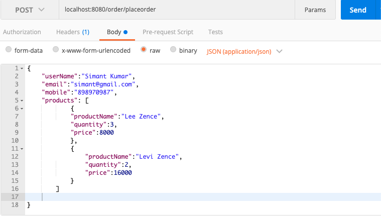
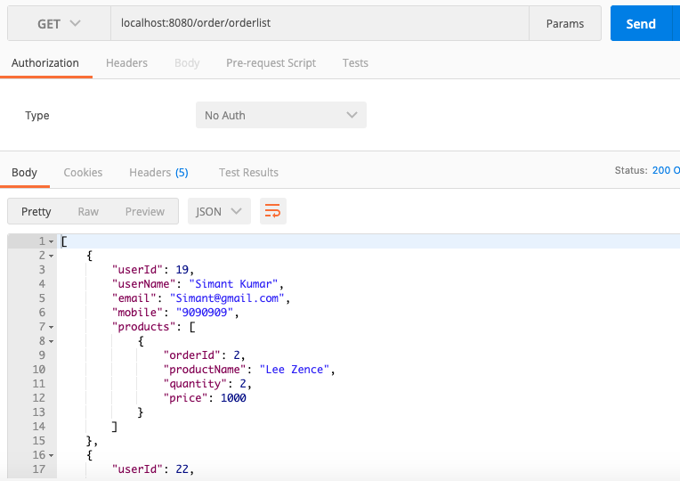

# user-order-relation
OneToMany Mapping example with join using Spring boot, Data JPA, Mysql Driver, .

Add Dependency :-
---
Go to start.spring.io and Create a project with following dependency
1. Web 
   >   Build web, including RESTful, applications using Spring MVC. Uses Apache Tomcat as the default embedded container.  
   
   > When you select Web Dependency then spring-boot-starter-web dependency is added in pom.xml file. 
   
   > spring-boot-starter-web is reponsible for web dependency and also include spring-boot-starter-tomcat.  
   
   > Web starter also reposible to load spring-core, spring-mvc, jackson, spring-boot-satrter and tomcat starter. 
   
   > spring-boot-starter-tomcat is responsible about the tomcat server like core, logging, websocket. 
      
2. Spring Data JPA
    Persist data in SQL stores with Java Persistence API using Spring Data and Hibernate. 
   > Spring Data JPA add a layer on top of the JPA. it means Spring Data JPA use all feature of JPA specification. Like Entity relation mapping,
     JPA query capability. 
     
   > Spring Data JPA reduced the boilerplate code of JPA that why Spring Data JPA is easier and Faster. 
   
   >  There are thre main feature of Spring Data JPA.  
   
     * No-Code Repository :-  
       > It gives higher abstraction , means the complete implementation is hiden. 
     * Reduce boilerplate code :-  
       > Provide the default implementation of each method by its Repository interface , so we don't need to implement read and write operations. 
     * Generate Query :-  
       > Generation of database Query based on the method name . Like filterByProductName() .... 
   > Spring Data JPA provide three repository Interface . 
   
      * CrudRepository:-  
         > CRUD repository are responsible to perform Create, Read, Update and Delete operation. 
      * PaginationAndSortingRepository :-  
         > This repository allow to retrieve data in pagination fashion . 
         > PaginationAndSortingRepository extends CrudRepository and add method findAll(). 
      * JpaRepository :- 
         > It is JPA specific repository defined in Spring Data JPA . 
         > It extends both the repository CrudRepository and PaginationAndSortingRepository.
         > It add JPA specific method Like flush(). 
3. Sql 
    MySQL JDBC and R2DBC driver.
  
4. DevTool
  Provides fast application restarts, LiveReload, and configurations for enhanced development experience.
   When we save file then application automatically restart and load the changes , not need to manually restart the server.
 
Project Creation snapsort
---

Dependency Added in pom.xml file snapsort
---

Table Structure snapsort
---

Postman Request formate
---
> Save Request

> Get Request

